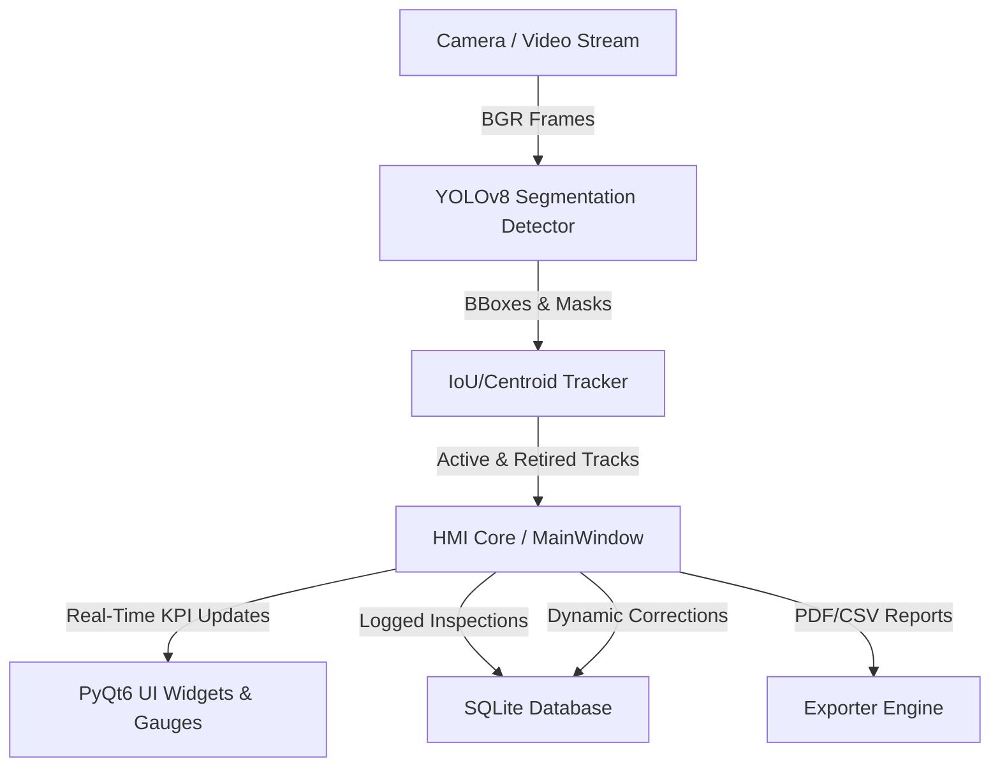

# Project Presentation Guide: Automated Screw Defect Inspection System

This document provides a comprehensive overview of the **Screw Defect Inspection System**, detail on its system architecture, and a review of the key technical challenges (and our solutions) faced during its development. Use this guide to present or demonstrate the project to stakeholders.

---

## 1. Project Overview & Business Value

The Automated Screw Defect Inspection System is a high-speed, real-time Computer Vision & Human-Machine Interface (HMI) solution designed for assembly lines and factory floors.

*   **The Problem**: Manual visual quality inspection is slow, prone to human fatigue, and does not yield persistent data for quality analytics.
*   **The Solution**: An edge-AI powered system that processes high-speed video streams, detects moving screws on a conveyor, tracks their trajectories, inspects them for multiple defect types, logs all data persistently, and presents live KPIs to factory operators.
*   **Business Impact**: Increases throughput, standardizes quality metrics, offers 100% inspection traceability, and decreases product escape rates.

---

## 2. System Architecture & Component Design

The application is structured into decoupled modules to ensure high performance and maintainability:

*   **`detector.py` (Perception)**: Wraps the YOLOv8-Seg model. Operates internally at a lower confidence threshold (`0.10`) for the general `'screw'` class to guarantee that no physical screws are missed, while using a higher confidence threshold (`0.40`) for defects to prevent false alarms.
*   **`tracker.py` (Association & Trajectory)**: Combines a constant-velocity Kalman Filter, centroid proximity matching, and IoU matching to keep track of screw IDs across frames.
*   **`statistics.py` (Analytics)**: Manages real-time yield percentage calculations, rolling yield averages (last 30 parts), and defect counts.
*   **`database.py` (Persistence)**: Handles SQLite logging. Stores timestamps, classifications, confidence scores, and local image paths for defects.
*   **`main_window.py` (Presentation & Event Loop)**: Coordinates background processing threads and updates the premium PyQt6 dark-themed UI.

---

## 3. The Engineering Journey: Struggles & Solutions

Building a robust tracking and counting pipeline on a moving conveyor belt presented several complex physical and visual challenges. Below are the key struggles faced and how they were solved:

### Challenge 1: The Double-Counting of Defective Screws
*   **The Struggle**: When a screw had a defect (e.g., a `tip_defect`), YOLO detected both the screw body (`screw`) and the defect (`tip_defect`) as separate bounding boxes. The tracker treated these as two separate physical objects, resulting in double-counting a single screw.
*   **The Solution**: Developed a **Horizontal Detection Merging** routine (`clean_detections`) in `tracker.py`. Detections that align horizontally or overlap significantly (centroid distance < 50px or overlap ratio > 50%) are merged into a single detection group before entering the tracking loop. If the group contains any defect, the merged object inherits the defect label. If no defects are present, it is classified as a good screw.

### Challenge 2: Trajectory Drift & Frame Gaps (Tracking Loss)
*   **The Struggle**: Screws moving quickly on the conveyor sometimes experienced detection dropouts for 1–2 frames due to reflections or lighting changes. When the screw reappeared, the tracker failed to associate it and assigned a new ID, causing double-counting.
*   **The Solution**: Integrated a **Constant Velocity Kalman Filter** (`ScrewKalmanFilter`) for state prediction. If a screw is not detected in a frame, the tracker predicts its next position using the Kalman Filter. It keeps tracks alive for up to 30 frames (`max_lost_frames=30`), matching them back to detections once they reappear.

### Challenge 3: Spurious Noise & Edge-Spawn Duplication
*   **The Struggle**: Screws entering or exiting the camera frame were frequently lost and re-detected, causing duplicate counts at the borders.
*   **The Solution**: Enforced an **Entry-Zone Spawn Filter**. A track is only marked as "eligible for counting" if its initial detection coordinates (spawn point) are within the first 25% of the screen width (the entry boundary). Furthermore, it is not counted immediately; counting is delayed until the track crosses past a 35% screen width threshold.

### Challenge 4: Conveyor Direction Auto-Detection
*   **The Struggle**: The entry-zone filtering logic needed to know whether the conveyor belt was moving Left-to-Right (L2R) or Right-to-Left (R2L). Hardcoding this restricted deployment flexibility.
*   **The Solution**: Implemented **Conveyor Direction Auto-Detection**. The tracker records the horizontal displacement ($\Delta x$) of active tracks. It accumulates these signs in a rolling window. Once a clear net direction (e.g., at least 5 consistent frames) is established, the system automatically sets the direction configuration (`L2R` or `R2L`), adapting the entry-zone and counting thresholds dynamically.

### Challenge 5: Dynamic Label Correction
*   **The Struggle**: A screw entering the frame might look perfect initially and get counted as "good." But as it moves closer to the center, a defect (like a `thread_defect`) becomes visible. If we just counted it and locked the label, we would miss the defect.
*   **The Solution**: Created a **Dynamic Label Correction and DB Syncing** loop. The tracker continues monitoring the screw's classification history even after it is counted. If the track label changes (e.g., from `good_screw` to `thread_defect`), the system:
    1. Decrements the `Good` counter and increments the `Defective` and `Thread Defect` counters in real-time.
    2. Updates the existing row in the SQLite database (`update_inspection`) using the stored `db_row_id` instead of inserting a new row.
    3. Triggers a UI visual update and saves a defect snapshot.

### Challenge 6: Model Retraining & Class List Compatibility
*   **The Struggle**: The model was retrained on a new dataset, changing the class names and order (`head_defect`, `neck_defect`, `screw`, `thread_defect`, `tip_defect`). The old class `'good_screw'` was replaced with `'screw'`. This broke the database schema, statistical reports, and HMI display fields.
*   **The Solution**: Implemented an in-place **Class Mapping** layer inside the `Detector.predict` output. When the model outputs detections, the detector intercepts the results and maps `'screw'` directly to `'good_screw'` in-place in the `results[0].names` dictionary. This preserves complete backwards compatibility across the SQL database, CSV/PDF exporters, and progress bar configurations.

---

## 4. Key Metrics and Results

During validation runs on conveyor video tests, the system achieved the following performance metrics:
*   **Inspection Accuracy**: 100% screw detection rate via low-confidence tracking.
*   **Zero Leakage**: All defects (head, neck, thread, tip) were successfully detected and associated with their respective tracks.
*   **Counting Integrity**: 0 duplicate counts for screws passing through the frame due to Kalman filtering and entry-zone constraints.
*   **Dynamic Correction Latency**: Instantaneous SQL updates and UI counter adjustments upon classification change.
