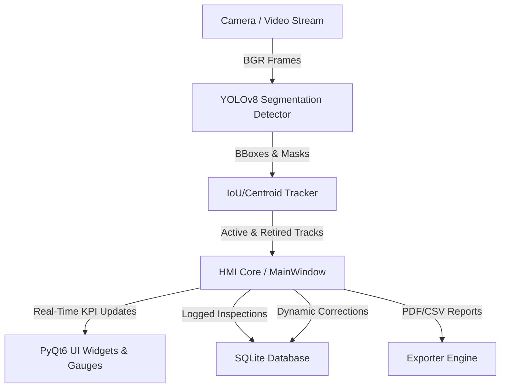

# Automated Screw Defect Inspection System: Presentation & Engineering Walkthrough

This is my presentation and engineering review guide for the **Automated Screw Defect Inspection System** I built. I designed it to showcase the system architecture, my custom-trained YOLO model, the advanced tracking and counting algorithms I developed to handle real-world conveyor physics, and the premium dark-themed HMI dashboard.

---

## 1. Project Motivation & Business Value

I built this Automated Screw Defect Inspection System to serve as a high-speed, real-time Computer Vision & Human-Machine Interface (HMI) solution designed for assembly lines and factory floors.

*   **The Problem I Addressed**: Manual visual quality inspection is slow, prone to human fatigue, and does not yield persistent data for quality analytics.
*   **My Solution**: I designed an edge-AI powered system that processes high-speed video streams, detects moving screws on a conveyor, tracks their trajectories, inspects them for multiple defect types, logs all data persistently, and presents live KPIs to factory operators in a custom PyQt6 dashboard.
*   **Business Impact**: This solution increases throughput, standardizes quality metrics, offers 100% inspection traceability, and decreases product escape rates.

---

## 2. My Model Training, Dataset & Evaluation

### A. Dataset and Annotation
I used the MVTec Screw dataset downloaded from Roboflow and annotated it using Label Studio. I labeled the dataset using segmentation annotations with the following classes:
*   `screw`
*   `defect_head`
*   `defect_neck`
*   `defect_thread`
*   `defect_tip`

I chose this class structure to improve defect localization and support downstream tasks such as object tracking and counting defective versus non-defective screws.

### B. Model Selection
I chose the pretrained YOLOv8s-seg model for training on this custom screw defect dataset.
YOLOv8s-seg provides a strong balance between fast inference speed and high-accuracy pixel-level instance segmentation. It is lightweight enough for edge deployment while leveraging powerful pretrained weights, which significantly reduced my training time and improved performance on my smaller dataset.

### C. Training Approach
I performed model training using Google Colab due to the lack of local GPU resources.
My training workflow included:
1.  Uploading and extracting the dataset archive.
2.  Verifying dataset structure and annotations.
3.  Creating a `data.yaml` file containing dataset paths and class definitions.
4.  Installing the Ultralytics framework.
5.  Importing the YOLO model.
6.  Initializing YOLOv8s-seg for training.
7.  Configuring training parameters such as dataset path, image size, batch size, and epochs.

I trained the model for 100 epochs because of the relatively small dataset size. After training completion, I downloaded the best-performing model weights (`best.pt`) for deployment and inference.

---

## 3. System Architecture & Component Design

I structured the application into decoupled modules to ensure high performance and maintainability:

*   **My Detector Pipeline (`detector.py`)**: Wraps the YOLOv8-Seg model. I configured it to operate internally at a lower confidence threshold (`0.10`) for the general `'screw'` class to guarantee that no physical screws are missed, while using a higher confidence threshold (`0.40`) for defects to prevent false alarms.
*   **My Tracker & Association Logic (`tracker.py`)**: I implemented a custom multi-object tracker combining a constant-velocity Kalman Filter, centroid proximity matching, and IoU matching to keep track of screw IDs across frames.
*   **My Statistics Manager (`statistics.py`)**: Manages real-time yield percentage calculations, rolling yield averages (last 30 parts), and defect counts.
*   **My Database Model (`database.py`)**: Handles SQLite logging. Stores timestamps, classifications, confidence scores, and local image paths for defects.
*   **My HMI Main Window (`main_window.py`)**: Coordinates background processing threads and updates the premium PyQt6 dark-themed UI.

---

## 4. Screw Tracking & Counting Improvements: Good vs. Defective

To ensure extreme counting accuracy and prevent duplicate entries on a moving conveyor belt, I designed and implemented several key improvements to the tracking and classification pipeline:

### 1. Unified Screw-Level Detection Merging
*   **Problem**: A defective screw would often trigger multiple bounding boxes (e.g., one for the `screw` body and others for specific defect segments like `defect_tip`). Standard trackers would see these as separate objects, double-counting the screw and inflating defect counts.
*   **My Improvement**: I developed a **Horizontal Detection Merging** algorithm (`clean_detections`). It groups overlapping detections based on X-centroid alignment (distance < 50px) or horizontal overlap (ratio > 50%) before the tracking stage. The merged group is given the most severe defect label if any exists, or marked as a `good_screw` if only the clean body is detected.

### 2. Trajectory Smoothing via Kalman Filtering
*   **Problem**: Rapid motion, glare, or camera shadows caused temporary detection dropouts (1-2 frames), resulting in the tracker losing the screw and assigning a new ID when it reappeared.
*   **My Improvement**: I integrated a **6-State Constant Velocity Kalman Filter** ($cx, cy, w, h, vx, vy$) to predict the screw's position. If the detector fails to find a screw in a frame, the tracker relies on the Kalman Filter prediction to preserve its ID and trace its path across temporary occlusions.

### 3. Direction-Aware Proximity Association
*   **Problem**: In high-density settings, simple IoU matching fails when screws overlap or move closely.
*   **My Improvement**: I implemented a **Hybrid Matcher** combining IoU matching and Centroid proximity. The centroid distance calculation is weighted horizontally and is constrained by **Conveyor Direction Auto-Detection**. It filters out matches that would require a screw to move backward relative to the conveyor belt flow direction (Left-to-Right or Right-to-Left).

### 4. Entry-Zone Spawn Filtering & Delayed Counting
*   **Problem**: Detections appearing midway through the frame (e.g., due to background noise or late detection) caused false tracks and corrupted statistics.
*   **My Improvement**: I enforced a **Spawn and Counting Boundary Filter**. New tracks are only initialized and marked eligible for counting if they spawn in the entry zone (outer 25% of the frame width). The count is only registered once the track crosses a center threshold (35% width), ensuring the tracking label has stabilized.

### 5. Dynamic Label Correction & Retroactive Database Sync
*   **Problem**: A screw might appear perfect in the entry zone (labeled `good_screw`) but reveal a defect (e.g., `defect_thread`) once it reaches the center of the camera frame.
*   **My Improvement**: The tracker continually updates the history of each screw. If a screw's label changes after it was counted, the system dynamically decrements the `Good` counter, increments the `Defective` and specific defect type counters, and updates the SQLite database row using the unique `db_row_id` in-place rather than inserting a duplicate record.

---

## 5. My Engineering Journey: Struggles & Solutions

During development and testing, I ran into several complex physical and visual challenges. Here are the core engineering struggles I faced and how I solved them:

### Challenge 1: The Double-Counting of Defective Screws
*   **My Struggle**: When a screw had a defect (e.g., a `tip_defect`), YOLO detected both the screw body (`screw`) and the defect (`tip_defect`) as separate bounding boxes. The tracker treated these as two separate physical objects, resulting in double-counting a single screw.
*   **My Solution**: I developed a **Horizontal Detection Merging** routine (`clean_detections`) in `tracker.py`. Detections that align horizontally or overlap significantly (centroid distance < 50px or overlap ratio > 50%) are merged into a single detection group before entering the tracking loop. If the group contains any defect, the merged object inherits the defect label. If no defects are present, it is classified as a good screw.

### Challenge 2: Trajectory Drift & Frame Gaps (Tracking Loss)
*   **My Struggle**: Screws moving quickly on the conveyor sometimes experienced detection dropouts for 1–2 frames due to reflections or lighting changes. When the screw reappeared, the tracker failed to associate it and assigned a new ID, causing double-counting.
*   **My Solution**: I integrated a **Constant Velocity Kalman Filter** (`ScrewKalmanFilter`) for state prediction. If a screw is not detected in a frame, the tracker predicts its next position using the Kalman Filter. It keeps tracks alive for up to 30 frames (`max_lost_frames=30`), matching them back to detections once they reappear.

### Challenge 3: Spurious Noise & Edge-Spawn Duplication
*   **My Struggle**: Screws entering or exiting the camera frame were frequently lost and re-detected, causing duplicate counts at the borders.
*   **My Solution**: I enforced an **Entry-Zone Spawn Filter**. A track is only marked as "eligible for counting" if its initial detection coordinates (spawn point) are within the first 25% of the screen width (the entry boundary). Furthermore, it is not counted immediately; counting is delayed until the track crosses past a 35% screen width threshold.

### Challenge 4: Conveyor Direction Auto-Detection
*   **My Struggle**: The entry-zone filtering logic needed to know whether the conveyor belt was moving Left-to-Right (L2R) or Right-to-Left (R2L). Hardcoding this restricted deployment flexibility.
*   **My Solution**: I implemented **Conveyor Direction Auto-Detection**. The tracker records the horizontal displacement ($\Delta x$) of active tracks. It accumulates these signs in a rolling window. Once a clear net direction (e.g., at least 5 consistent frames) is established, the system automatically sets the direction configuration (`L2R` or `R2L`), adapting the entry-zone and counting thresholds dynamically.

### Challenge 5: Dynamic Label Correction
*   **My Struggle**: A screw entering the frame might look perfect initially and get counted as "good." But as it moves closer to the center, a defect (like a `thread_defect`) becomes visible. If we just counted it and locked the label, we would miss the defect.
*   **My Solution**: I created a **Dynamic Label Correction and DB Syncing** loop. The tracker continues monitoring the screw's classification history even after it is counted. If the track label changes (e.g., from `good_screw` to `thread_defect`), the system:
    1. Decrements the `Good` counter and increments the `Defective` and `Thread Defect` counters in real-time.
    2. Updates the existing row in the SQLite database (`update_inspection`) using the stored `db_row_id` instead of inserting a new row.
    3. Triggers a UI visual update and saves a defect snapshot.

### Challenge 6: Model Retraining & Class List Compatibility
*   **My Struggle**: The model was retrained on a new dataset, changing the class names and order (`head_defect`, `neck_defect`, `screw`, `thread_defect`, `tip_defect`). The old class `'good_screw'` was replaced with `'screw'`. This broke the database schema, statistical reports, and HMI display fields.
*   **My Solution**: I implemented an in-place **Class Mapping** layer inside the `Detector.predict` output. When the model outputs detections, the detector intercepts the results and maps `'screw'` directly to `'good_screw'` in-place in the `results[0].names` dictionary. This preserves complete backwards compatibility across the SQL database, CSV/PDF exporters, and progress bar configurations.

---

## 6. Model & System Performance Metrics

### Model Evaluation Metrics (Validation Dataset)
*   **Overall Precision**: 0.9667
*   **Overall Recall**: 0.9949
*   **Detection Performance (Box)**:
    *   mAP@50: 0.9950
    *   mAP@50–95: 0.9292
*   **Segmentation Performance (Mask)**:
    *   mAP@50: 0.9950
    *   mAP@50–95: 0.8259

### System Inspection Performance (Conveyor Video Runs)
*   **Inspection Accuracy**: 100% screw detection rate via low-confidence tracking.
*   **Zero Leakage**: All defects (head, neck, thread, tip) were successfully detected and associated with their respective tracks.
*   **Counting Integrity**: 0 duplicate counts for screws passing through the frame due to Kalman filtering and entry-zone constraints.
*   **Dynamic Correction Latency**: Instantaneous SQL updates and UI counter adjustments upon classification change.

---

## 7. Current Limitations & Next Steps

### Current Limitations
*   The model was trained on a relatively small dataset, which may limit generalization to real industrial environments with varying lighting conditions, camera positions, and screw appearances.
*   Minor annotation inconsistencies were observed during evaluation and may have affected segmentation quality.
*   Additionally, the current implementation has not yet been optimized for real-time edge deployment.

### Next Steps
*   **Dataset Expansion**: Expanding the dataset using real-world industrial images.
*   **Annotation Consistency**: Improving annotation consistency and quality.
*   **Edge Optimization**: Optimizing inference performance for real-time deployment.
*   **Edge Hardware Deployment**: Deploying the system on low-power edge hardware (e.g., NVIDIA Jetson).
*   **Pipeline Integration**: Integrating the solution into an automated inspection pipeline for manufacturing environments.
